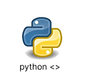

# MiniPython
 

 
## 🎯 Objectifs
MiniPython est un mini-langage de programmation inspiré de Python.
Il permet d'apprendre les bases de la compilation, de l'analyse
lexicale et syntaxique, ainsi que la documentation d'un langage.
 
## ⚙️ Installation
### Prérequis
- Python 3.8 ou plus
- VS Code 

### Installation
```bash
git clone https://github.com/Douniaoul/miniPython.git
cd minipython
py minipython.py

### auteurs :
oulhaci dounia
touala hadjer 
